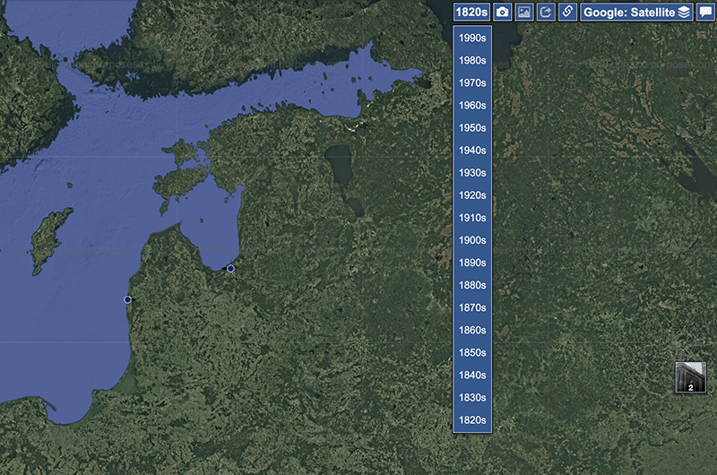

# PastVu Decade Selector

This Chrome extension allows you to quickly select decades (80s, 90s, etc.) on PastVu.com for easier browsing of historical photos.

## Features
- One-click decade selection
- Fast switching between different time periods
- Smoother browsing experience

## Installation
1. Download the extension as a `.zip` file.
2. Open Chrome and go to `chrome://extensions/`.
3. Enable "Developer mode" in the top-right corner.
4. Click "Load unpacked" and select the extension folder.

## Credits
Icon modified from original by [PastVu.com](https://pastvu.com), licensed under [CC BY 4.0](https://creativecommons.org/licenses/by/4.0/).

## Disclaimer
This extension is an independent project and is not affiliated with, endorsed by, or officially connected to PastVu.com.

## License
[MIT License](LICENSE)